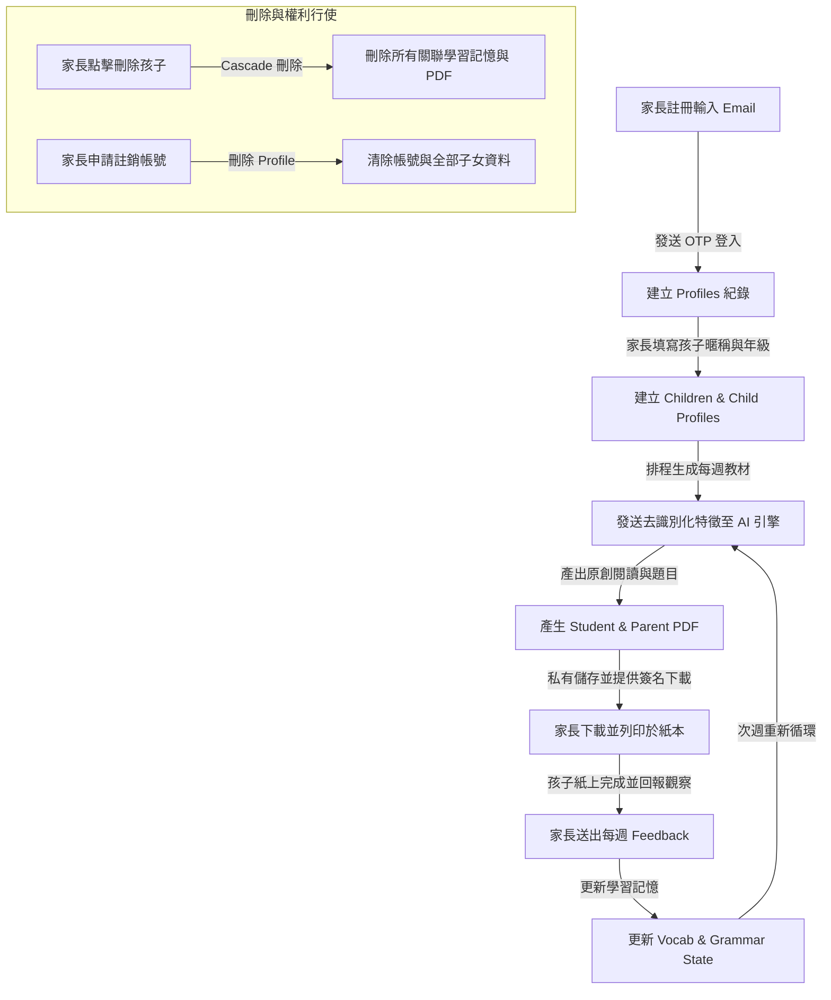

# 紙屬英文 (Paper English) 個人資料流通與盤點表 (Data Inventory & Flow Map)

**更新日期：** 2026-08-16  
**法規遵循：** 中華民國《個人資料保護法》第 8 條、第 19 條、第 20 條、第 27 條  

---

## 1. 資料主體與收集範圍盤點

| 資料項目 | 資料主體 | 收集目的 | 法定事由 (PDPA §19) | 必要性 | 儲存位置 | 外部處理者 | 保存期間 | 刪除機制 |
| :--- | :--- | :--- | :--- | :--- | :--- | :--- | :--- | :--- |
| **家長 Email** | 家長 | 帳號登入 (OTP)、交易發票通知、重要服務異動通知 | 契約履行 (§19.1.2) | **必要** | Supabase `auth.users` | Supabase Auth, Resend/Gmail SMTP | 帳號存續期間；註銷後立即刪除 | 帳號刪除時觸發 CASCADE 刪除 |
| **家長暱稱/稱謂** | 家長 | 介面稱呼、個人化客服 | 契約履行 (§19.1.2) | 選填 | Supabase `public.profiles` | Supabase | 帳號存續期間 | 帳號刪除時立即刪除 |
| **條款與隱私同意紀錄** | 家長 | 履行法定告知義務之佐證 | 法律明文規定 (§19.1.1) | **必要** | Supabase `public.profiles` | Supabase | 帳號存續期間及法定爭訟時效 (5年) | 帳號註銷並經過時效後永久刪除 |
| **孩子暱稱 (Display Name)** | 學生 (未成年人) | 教材開頭個人化問候與標題 | 家長明示同意與契約履行 | **必要** (僅限暱稱) | Supabase `public.children` | Supabase, OpenAI / LLM API (僅作為教材問候) | 該學習檔案存續期間 | 家長刪除孩子或帳號時立即刪除 |
| **就學年級 (Grade)** | 學生 (未成年人) | 錨定國中會考能力指標與課綱深度 | 契約履行 (§19.1.2) | **必要** (僅年級) | Supabase `public.children` | Supabase, OpenAI / LLM API | 該學習檔案存續期間 | 隨孩子檔案刪除 |
| **課本版本 (Textbook)** | 學生 | 對齊南一/康軒/翰林進度 | 契約履行 (§19.1.2) | **必要** | Supabase `public.children` | Supabase, OpenAI / LLM API | 該學習檔案存續期間 | 隨孩子檔案刪除 |
| **學習興趣 (Interests)** | 學生 | 撰寫閱讀情境主題 (如：籃球、程式) | 家長明示同意 | 選填 (強烈建議通用偏好) | Supabase `public.child_profiles` | Supabase, OpenAI / LLM API (作為 Prompt 情境) | 該學習檔案存續期間 | 隨孩子檔案刪除 |
| **學習目標與弱項** | 學生 | 調整文法與單字複習頻率 | 契約履行 (§19.1.2) | 選填 | Supabase `public.child_profiles` | Supabase, OpenAI / LLM API | 該學習檔案存續期間 | 隨孩子檔案刪除 |
| **每週學習回饋 (Feedback)** | 家長 / 學生 | 評估上週教材難度、完成度與錯因 | 契約履行 (§19.1.2) | **必要** (調整關鍵) | Supabase `public.feedback` | Supabase | 該學習檔案存續期間 | 隨孩子檔案刪除 |
| **單字掌握與錯題記憶** | 學生 | 建立個人化錯題本與螺旋複習排程 | 契約履行 (§19.1.2) | **必要** | Supabase `public.child_vocab_progress`, `child_grammar_progress`, `child_learning_state` | Supabase | 該學習檔案存續期間 | 隨孩子檔案刪除 |
| **每週生成之 PDF** | 學生 / 家長 | 交付學生教材與家長解答 | 契約履行 (§19.1.2) | **必要** | Supabase Storage (`weekly-materials`) | Supabase Storage (私有加密儲存) | 訂閱存續期間；帳號刪除後清除 | 家長刪除檔案時觸發 Storage 物件清除 |
| **交易與訂閱紀錄** | 家長 | 履約查核、扣款對帳、稅捐稽核 | 稅捐稽徵法及商業會計法 | **必要** | Supabase `public.subscriptions` | Paddle (Merchant of Record) | 依稅法規定保存 5–7 年 | 法定保存期滿後封存/銷毀 |
| **技術與伺服器日誌** | 家長 | 系統除錯、資安防護、防範未授權存取 | 正當利益與資安防護 | **必要** | Supabase 日誌 / Cloudflare | Supabase, Cloudflare | 最長 90 天 | 90 天自動滾動覆蓋刪除 |

---

## 2. 嚴格禁止收集之機敏資料清單 (Prohibited Data Checklist)

本系統於前端輸入驗證、資料庫限制及提示詞生成中，**嚴格禁止**主動要求或收集下列資料：

1. ❌ 孩子的真實中文全名、戶籍登記姓名
2. ❌ 國民身分證統一編號、居留證號、護照號碼
3. ❌ 出生年月日（僅收集就學年級 stage）
4. ❌ 就讀學校全名、班級、座號、導師姓名
5. ❌ 住宅詳細地址、即時地理定位 (GPS)
6. ❌ 學生個人照片、臉部生物辨識特徵、聲音錄音
7. ❌ 醫療病歷、基因、性生活、犯罪前科等法定特種個資 (PDPA §6)
8. ❌ 信用卡完整卡號與 CVV 安全碼（全由 Paddle PCI-DSS 認證環境處理，本伺服器絕不接觸）

---

## 3. 資料處理生命週期流程 (Data Lifecycle Flow)

