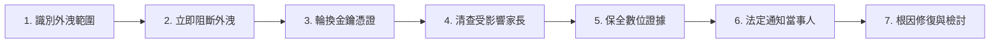

# 紙屬英文 (Paper English) 個人資料外洩與資安事故應變標準作業程序 (Incident Response Protocol)

**生效日期：** 2026-08-16  
**法規基準：** 中華民國《個人資料保護法》第 12 條、《個人資料保護法施行細則》第 22 條  

---

## 1. 事故應變原則與法定通報義務 (Core Principles & Legal Duty)

依據《個人資料保護法》第 12 條規定：「非公務機關維護個人資料發生被竊取、洩漏、竄改或其他侵害事故者，應於查明後以適當方式通知當事人。」

紙屬英文涉及未成年人學習資料與家長帳號，對資安事故採取 **「零隱匿、速阻斷、速通知、除根因」** 之最高原則。

---

## 2. 資安事故處理標準 7 步驟 (7-Step Incident Handling Procedure)

### 步驟 1：識別受影響資料與範圍 (Identify Affected Scope)
* 立即由工程負責人確認外洩之資料層級：
  - **Level 1（輕微）：** 僅涉及去識別化之技術日誌或公開頁面。
  - **Level 2（中度）：** 涉及家長 Email、登入中繼代碼。
  - **Level 3（嚴重）：** 涉及學生暱稱、學習弱項紀錄、未公開教材或資料庫存取權限外洩。

### 步驟 2：立即阻斷曝險 (Stop Exposure Immediately)
* 暫時下線或隔離受影響之 Supabase 服務端點、Storage Bucket 或 Edge Functions。
* 若發生 RLS 漏洞，立即透過資料庫命令撤銷有問題之存取權限。

### 步驟 3：輪換所有服務憑證與金鑰 (Rotate All Credentials)
* 立即重新產生並替換以下關鍵機密：
  1. `SUPABASE_SERVICE_ROLE_KEY` 及 `ANON_KEY`
  2. 資料庫密碼 (Database Password)
  3. Paddle API Key & Webhook Secret
  4. OpenAI / LLM API Key
  5. SMTP 郵件伺服器密碼與 GitHub Actions Secrets

### 步驟 4：清查受影響當事人清單 (Determine Affected Users)
* 透過資料庫存取日誌（Audit Logs）清查受影響之 Parent User ID 與對應之 Child ID。
* 產製受損害用戶之名冊與聯絡 Email。

### 步驟 5：保全必要之數位鑑識證據 (Preserve Evidence)
* 匯出並安全保存攻擊發生前後之伺服器 Access Logs、Postgres 交易紀錄與 Edge Function 執行紀錄。
* 嚴禁覆蓋日誌或破壞系統鑑識跡證。

### 步驟 6：依法通知當事人與主管機關 (Notify Data Subjects & Authority)
* 依《個人資料保護法施行細則》第 22 條，於查明事故後以 Email 及官方網站公告方式即時通知受影響之家長。
* **通知內容必須載明：**
  1. 個人資料被侵害之事實與發生時間。
  2. 本系統已採取之緊急補救與防護措施。
  3. 建議家長防範之注意事項（例如注意釣魚信件）。
  4. 紙屬英文專屬諮詢與客服窗口（Email 與聯絡管道）。
* 若情節重大（例如外洩人數超過主管機關通報標準），應同步向數位發展部或個人資料保護專責機關辦理通報。

### 步驟 7：根本原因修復與架構檢討 (Remediate & Post-Mortem)
* 完成漏洞修補與自動化測試（防範相同問題復發），召開事故檢討會，更新 `LEGAL-AUDIT.md` 與資安防護規範。
